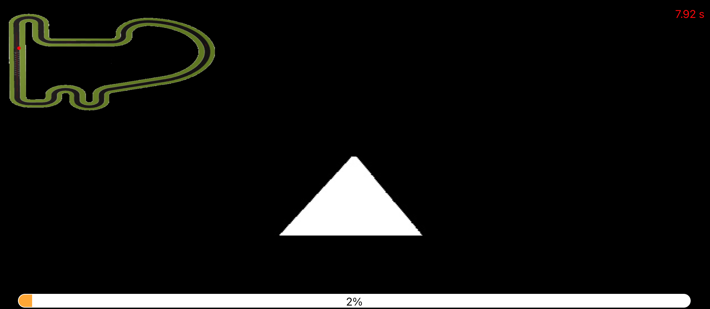

Para esta práctica, el coche de Fórmula 1 debe recorrer un circuito siguiendo una línea roja. Al principio, me centré en entender el problema y en cómo hacer que el coche pudiera detectar y seguir la línea correctamente.

Lo primero fue procesar la imagen que captura la cámara del coche. Convertí la imagen a HSV para filtrar los tonos rojos y así detectar la línea, también recorté la imagen para eliminar ruido y evitar que el coche detecte elementos irrelevantes del entorno. 

<em>Figura 1: Máscara detección línea roja.</em>

